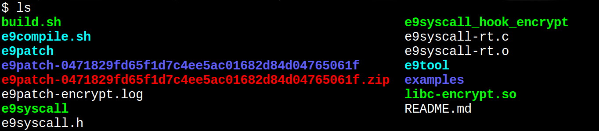
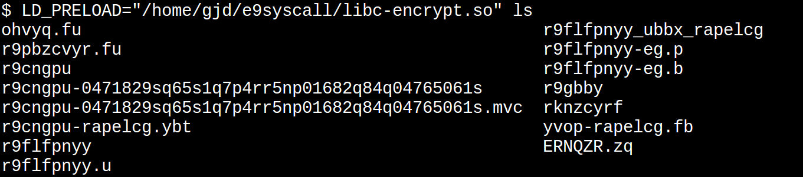

# E9Syscall -- Linux System Call Interception

E9Syscall is a system call interception toolkit for `x86_64 Linux`.

E9Syscall uses [E9Patch](https://github.com/GJDuck/e9patch) to statically
rewrite `libc.so` into a new version with all system calls intercepted.
Unlike other interception tools, E9Syscall does not rely on `ptrace` or
signal handlers (`SIGTRAP`).

## Build

To build E9Syscall, simply run the `build.sh` script:

         $ ./build.sh

## Usage

To use E9Syscall:

1. Implement your system call hook routine, e.g., in a file `hook.c`.
   See the `examples/` directory for some examples.
2. Build a replacement `libc.so` using the command:

         $ ./e9syscall-build hook.c

This will build a modified `libc-hook.so` file which will call the hook
function every time a system call is executed.
To use, simply `LD_PRELOAD` the new library to replace the default,
e.g.:

        $ LD_PRELOAD=$PWD/libc-hook.so ls

The hook function has the following type signature:

        int hook(intptr_t arg1,
                 intptr_t arg2,
                 intptr_t arg3,
                 intptr_t arg4,
                 intptr_t arg5,
                 intptr_t arg6,
                 intptr_t *result);

The behavior depends on the return value of the took function.

* If zero, the original system call will be executed as normal.
* If non-zero, the original system call will be replaced with
  by `*result`.

This allows for system calls to be instrumented (if zero)
or replaced (if non-zero), depending on the application.
This design was inspired by
[`syscall_intercept`](https://github.com/pmem/syscall_intercept).

## Example

The `examples/encrypt.c` hook will "encrypt" all `stderr`/`stdout` using
[ROT13](https://en.wikipedia.org/wiki/ROT13).
To build, simply run:

        $ ./e9syscall examples/encrypt.c

This will build a modified `libc-encrypt.so` file.

By default, the output of the `ls` command is not encrypted:

By using `LD_PRELOAD` and `libc-encrypt.so`, the output of the `ls`
command is automatically encrypted:

See the `examples/*.c` files for other example hook functions.

## Limitations

For technical reasons, the `SYS_rt_sigreturn` and `SYS_clone` system calls
cannot be replaced.

The instrumentation code is somewhat limited, including:

* Cannot directly call libc functions (using system calls directly is OK)
* Cannot safely use/clobber floating point registers
* Stack may not be aligned

These limitations are inherited from the underlying E9Patch tool.

There is a chance that not call system calls can be intercepted, in which case
a warning will be printed.
However, it seems to work for all versions of libc tested so far.

## About

E9Syscall is a thin [E9Patch](https://github.com/GJDuck/e9patch) wrapper,
which is a powerful static binary rewriting tool for `x86_64 Linux`.

Basically, E9Syscall invokes E9Patch to replace all `syscall` instructions
with a call to a trampoline that invokes the hook function.
Since the interception does not use `ptrace` or signal handlers, it
is very fast.

## Related Tools

A few different system call interception libraries and tools have been
developed, including:

Library/Tool | `ptrace`? | `SIGTRAP`? 
--- | --- | ---
[`syscall_intercept`](https://github.com/pmem/syscall_intercept) | &#9744; | &#9744;
[`SaBRe`](https://github.com/srg-imperial/SaBRe) | &#9744; | &#9744; | &#9744;
[`libsystrap`](https://github.com/stephenrkell/libsystrap) | &#9744; | &#9745;
[`ptrace_do`](https://github.com/emptymonkey/ptrace_do) | &#9745; | &#9744;
[`fssb`](https://github.com/adtac/fssb) | &#9745; | &#9744;

Some tools use `ptrace` or signal handlers, however this is generally slow
since it involves context switching.
E9Syscall calls the hook function directly without one (or more)
context switches.

Like E9Syscall, both `syscall_intercept` and `SaBRe` also use binary
rewriting.
However, these tools use a different rewriting methodology, including:

1. replacing multiple instructions with jumps; and/or
2. replacing NOP-padding with jumps.

This assumes that both 1. and 2. do not affect jump targets, which
is not sound in the general case.
However, for limited applications such as system call interception,
it is probably OK in practice.

E9Syscall uses E9Patch to safely rewrite `syscall` instructions
without modifying jump targets.
Please see
[here](https://github.com/GJDuck/e9patch) for more information.

## License

GPLv3

